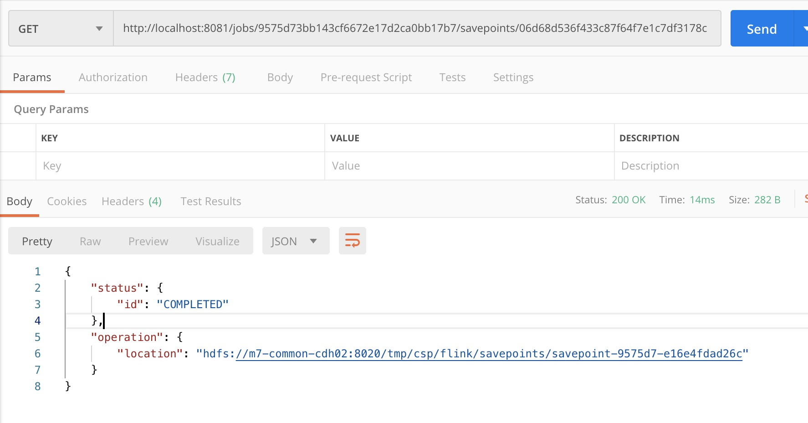

# csp-flink-operator

## Quickstart

* 参考 [Server Flink Job Tutorial](https://gitlab.4pd.io/csp/csp-data-platform/blob/master/csp-data-server/docs/tutorial/Tutorial.md#flink-%E7%AE%97%E5%AD%90)

## 版本相关

[Release-Note](docs/RELEASE_NOTE.md)

## 本地开发

1. 本地 Run 入口 `Main.java`, 直接运行即可
2. 参数介绍: 参考下面的具体介绍和项目 resources 目录下的 `application.properties` 文件
3. 本地开发需要注意: 目前 Flink 的 mac 环境(包括本地 JVM 环境和 standalone 环境)无法直接连上开 kerberos 了的 hdfs(仅限 flink 自带 API)。
   如果是本地开发遇到连 HDFS 权限问题, 可以找个不带权限的集群测试, 或者直接读本地文件, 涉及的关键配置: hadoop.home.dir

## 线上打包

* 需要指定 profile (有些依赖是集群有的, 不需要打入 jar 包, 但是本地运行需要)

```shell
mvn clean install -P prod
```

## 支持的算子

#### 文本引入相关:

`默认流式引入, 支持增量`

* Parquet -> Kafka (已完成)
* Orc -> Kafka (已完成)
* txt/csv/tsv -> Kafka (已完成)

> csv 为特殊的 txt, 列分隔符为 ,
>
> tsv 为特殊的 txt, 列分隔符为制表符 '\t'

#### JDBC 引入:

`仅支持批量引入`

* Hive -> Kafka (已完成)

[JDBC 其它引入参考 Kafka JDBC Connector](https://wiki.4paradigm.com/display/ep/Kafka+JDBC+Connector)

#### Kafka 引入相关:

* Kafka -> Kafka SQL 算子(已完成)
* Kafka -> Kafka 去重算子(已完成)

## 引入到 ES

* Parquet -> elasticsearch6 (已完成)

## 参数介绍

* 参数优先级
> 系统参数 > 用户输入的参数 -> 本地配置文件(resources 目录下的 `application.properties`)

参数名称参考 `PropertiesConstants.java` 类

---

| 参数名称  | 参数类型 | 参数说明 | 是否可以为空 | 备注
|---|---|---|---|---|
|job.name| String| 任务名称 | 是 | 为了方便区分，最好不要为空，默认: CSP StreamJob
|source.type| Enum| 数据源算子类型 | 否 | 目前支持: parquet, orc, csv, txt, jdbc, kafka(默认 kafka sql), kafka_deduplication (传入时可以不区分大小写)
|source.path| String| 文本引入: 数据源地址 | 是 | 如果是文本引入, 则不能为空, 目前只支持单个`目录`(流式引入监控这个目录下是否有新文件), 单个目录下文件 schema 必须相同, 并且不支持目录下含有嵌套目录
|source.watch.type| Enum| 文本引入: 引入方式(流式引入还是一次性引入)| 是 | 可选 PROCESS_CONTINUOUSLY, PROCESS_ONCE 默认: PROCESS_CONTINUOUSLY(流式引入, 随时监听目录下的新增文件), 如果是引入到 ES 一定要传入 PROCESS_ONCE, 否则任务不会停止
|source.watch.interval| Long| 文本引入: 监控 `source.path` 是否有新增文件的时间间隔 | 是 | 单位: 毫秒, 默认: 60000
|source.firstLine.schema| Boolean | 首行是否为 schema | 否 | 文本引入 csv/txt 需要, 默认: false 
|source.line.delimiter| String | 行分隔符 | 否 | 文本引入 csv/tsv/txt 需要, 默认: '\n', 支持以 ASCII 码方式传递
|source.field.delimiter| String | 列分隔符 | 否 |文本引入 csv/tsv/txt 需要, csv/txt 默认: ',' tsv 默认: '\t', 支持以 ASCII 码方式传递
|source.charset| String | 文件件编码| 否 | 文本引入 csv/txt 需要, 默认: UTF-8
|source.db.type| Enum | 数据库引入: 数据库类型 | 是 | 目前仅支持 hive (默认 hive)
|source.db.url| String | 数据库引入: 连接地址 | 是 | 如果是数据库引入, 则不能为空(需要包括 数据库 地址, 端口, 数据库信息)
|source.db.username| String | 数据库引入: 用户名 | 是 | 如果是数据库引入, 则不能为空
|source.db.password| String | 数据库引入: 用户密码 | 是 | 如果是数据库引入, 则不能为空
|source.db.driverClassName| String | 数据库引入: 驱动类名 | 是 | 系统默认提供, 可以传参覆盖
|source.db.table| String | 数据库引入: 引入的表名 | 是 | 如果是数据库引入, 则不能为空
|source.db.sql| String | 数据库引入: 引入的查询 sql | 是 | 如果是数据库引入, 最好提供 (默认 'select * from `tableName`') *注意 sql 值需要用 '' 括起来*
|source.db.fetch.size| Int | 数据库引入: 表示每次和数据库交互，得到记录行数 | 是 | 默认 50
|source.kafka.version| String | Kafka 引入数据源版本: 默认 0.11 | 否 | 支持: 0.9, 0.10, 0.11 默认 0.11
|source.kafka.brokers| String | Kafka 引入数据源地址 | 否 | 如果是 Kafka 为数据源, 则必须
|source.kafka.topic| String | Kafka 引入数据源 topic | 否 | 如果是 Kafka 为数据源, 则必须
|auto.offset.reset| Enum | Kafka Consumer offset 配置 | 否 | earliest,
|group.id| String | Kafka Consumer Group | 否 | 如果是 Kafka 为数据源, 则必须
|stream.sql.enable | Boolean | Kafka SQL 是否开启 | 否 | 默认 false, 如果 hdfs 引入, 需要开启 sql 筛选, 需要改成 true, 同时需要自行填入 `stream.sql.schema` 字段
|stream.sql.table| String | Kafka -> Kafka 引入执行 sql 的表名 | 否 | 默认 t1 (注意: 和 stream.sql 保持统一)
|stream.sql | String | Kafka -> Kafka 引入执行的 sql 语句 | 否 | 默认 select * from t1 (注意: 和 stream.sql.table 保持统一)
|stream.sql.schema| String | SQL 需要填入的数据源 Schema | 否 | 如果是 Kafka -> Kafka 引入则必填 [Schema 格式](#Kafka2Kafka schema) : struct<_col0:BigInt,_col1:String,_col2:String>
|stream.sql.schema.json| String | SQL 需要填入的数据源 Schema| 否 | 注意: 如果是文本(csv/tsv/txt)数据源, 此参数同时也会被当做是数据源的 schema, 需要 json 有序。此参数优先级高于 stream.sql.schema(如果两个都填了, 以 stream.sql.schema.json 为准) : {"col_0": "BigInt", "col_1": "String", "col_2": "String"}
|unique.data.ttl.in.minute|Long| Kafka -> Kafka 去重算子, 去重时间窗口, 单位分钟 | 否 | 默认 60(一小时)
|unique.keys| String | Kafka -> Kafka 去重算子指定的一组重复 key, 逗号分隔| 否 | 如果是 Kafka 去重算子则必须, eg: id,name
|sink.kafka.version| String| 目标 Kafka 版本 | 否 | 支持: 0.9, 0.10, 0.11 默认 0.11
|sink.kafka.brokers| String| 目标 Kafka 地址 | 否 | 如果是引入到 Kafka 则必填
|sink.kafka.topic| String| 目标 Kafka topic 名称| 否 | 如果是引入到 Kafka 则必填
|sink.type| Enum | 目标输出| 否 | 默认 kafka (可选 kafka, es)
|sink.es.server| String | ES 地址| 否 | 如果是 ES 引入则必须 eg: 172.27.14.125:9200 多个节点以 , 分割
|sink.es.index| String | ES Index | 否 | 如果是 ES 引入则必须
|sink.es.type | String | ES docType | 否| 如果是 ES 引入则必须, 注意 ES6 开始一个 mapping 中默认只能有一个 type
|sink.es.sync.type | Enum | ES 数据同步类型 | 否 | 如果是 ES 引入则必须, 可选: incremental(增量同步: 没有记录, 插入. 有记录, merge 更新), finite(限定同步: 只 merge 更新有记录的数据), full(全量覆盖同步, `注意: 只会同步数据, 不含删除操作, 不适合召回场景直接使用`),
|sink.es.unique.column | String | ES 数据同步唯一标识列 | 否 | 如果是 ES 引入则必须
|sink.es.version.column | String | ES 数据版本字段 | 否 | 默认 version (不能和业务字段冲突, 如果冲突请自行更新成别的名称即可, 否则会丢弃掉所有数据)
|sink.es.version | String | ES 引入版本字段 | 否 | ES 引入则必须, 用户输入当前时间戳即可, full 和 incremental 模式生效。(自动插入, 如果没有版本号要求, 可以不填。)
|sink.merge.enable| Boolean | 输出将打平的数据内嵌 | 是 | 默认 false 不开启
|sink.merge.nested.field| String | 输出内嵌的字段名称 | 是 | sink.merge.enable 为 true 时生效, 默认 `feas`
|sink.merge.exclude.fields| List<String> | 输出排除内嵌(保持原样的字段名称) | 是 |  sink.merge.enable 为 true 时生效, 默认 `id`, 多个字段以 `,` 分割
|stream.parallelism| Integer| 任务并行度 | 是 | 默认 1
|stream.sink.parallelism| Integer| sink 的并行度 | 是 | 默认 1 (写 Kafka/Elasticsearch 的并行度), `如果想要开启 EXACTLY_ONCE 需要适量增加`
|stream.checkpoint.enable| Boolean| 是否开启 Check | 是 | 默认 true 开启
|stream.checkpoint.dir| String| CheckPoint 地址 | 是 | 默认 hdfs:///tmp/csp/flink/checkpoints
|stream.checkpoint.type| Enum| CheckPoint 类型 | 是 | 可选: memory, fs, rocksdb, 默认 rocksdb (Kafka 去重算子强制 rocksdb)
|stream.checkpoint.interval| Long | checkpoint 周期时间 | 是 | 单位 ms, 默认 AT_LEAST_ONCE 模式下每一分钟(60000)进行一次, EXACTLY_ONCE 模式下每半分钟(30000)进行一次
|stream.checkpoint.timeout| Long | checkpoint 超时时间, 超时会被丢弃 | 是 | 默认 60_000 (十分钟), 单位 ms
|stream.checkpoint.tolerable.failure.num| Long | 最多允许 Checkpoint 失败 次数 | 是 | 默认 10
|stream.checkpoint.min.pause| Long | 两次 checkpoint 最小间隔 | 是 | 默认 1_000 (一秒钟), 单位 ms
|stream.checkpoint.mode| Enum | CheckPoint 模式 | 是 | 默认: AT_LEAST_ONCE (可选: EXACTLY_ONCE, AT_LEAST_ONCE) 注意: EXACTLY_ONCE 模式 kafka producer 也对应开启 EXACTLY_ONCE 模式(默认开启事务和幂等性) (EXACTLY_ONCE 模式注意事项)[### EXACTLY_ONCE 模式注意事项]
|job.retry.maxNumberRestartAttempts| Int | 任务失败重试次数 | 是 | 默认 4
|job.retry.backoffTimeMS| Long | 任务失败重试时间间隔 | 是 | 默认 60000 (一分钟)
|hadoop.home.dir| String | Hadoop 配置 | 是 | 默认从系统环境变量里取, 环境变量中没有则用用户输入的 (对于开启了 kerberos 的 Hadoop, 仅从 /etc/user.keytab 中取, 不接受覆盖)
|hadoop.user.name| String | Hadoop 用户名 | 是 | 默认从系统环境变量里取, 环境变量中没有则用用户输入的

### Kafka 参数透传

除了上述声明的 Kafka (sink/source) 参数外

默认 Kafka 参数:

* sink
    - sink.kafka.request.timeout.ms=180000 （默认 30s）
    - sink.kafka.compression.type=lz4 (默认 Producer)

如果想要透传 Kafka 参数

* sink
    sink.kafka.${原生 Kafka 参数}

* source
    source.kafka.${原生 Kafka 参数}

### EXACTLY_ONCE 模式注意事项

`批处理转流处理情况下, Producer 发送速度比较慢, `

数据量大的情况下需要注意

* 缩短 checkpoint interval
* 加快 Producer  写速度 (调整 Kafka Producer 参数, 增加 Producer 并行度)

    数据源为四个 8 G CSV 文件的调参建议:
    >"--stream.sink.parallelism", "5",
    >
    >"--sink.kafka.batch.size", "65536",
    >
    >"--sink.kafka.send.buffer.bytes", "262144",
    >
    >"--sink.kafka.buffer.memory", "67108864",

    详细介绍
    > 写 Kafka Sink 并行度(stream.sink.parallelism)增大到五
    > batch.size:
    >
    >      * 批量发送大小（默认：16384，16K）
    >
    >      * 此次建议 65536(64k)
    >
    >  buffer.memory:
    >
    >      * 生产者最大可用缓存 (默认：33554432，32M)
    >
    >      * 生产者产生的消息缓存到本地，每次批量发送batch.size大小到服务器。
    >
    >      * 此次建议 262144(64M)
    >
    >  send.buffer.bytes:
    >
    >      * 送数据时使用的TCP发送缓冲区(SO_SNDBUF)的大小。如果值是-1，将使用OS默认值。
    >
    >      * 默认 131072,128K. 推荐 128k~512k
    >
    >      * 此次建议 67108864(256k)
### ElasticSearch sink 高级参数

| 参数名称  | 参数类型 | 参数说明 | 是否可以为空 | 备注
|---|---|---|---|---|
|sink.es.update.retry.on.conflict| Int | 更新时遇到版本冲突, 重试次数 | 是 | 默认重试 5 次
|sink.es.bulk.flush.max.actions| Int | 每个Bulk请求，最大缓冲Action个数 | 是 | 默认 1000
|sink.es.bulk.flush.max.size.mb| Int | 每个Bulk请求，最大缓冲的Action大小 | 是 | 默认 5mb
|sink.es.bulk.flush.interval.ms| Long | Bulk刷新间隔。不论Action个数或Action大小如何设置，到刷新间隔了，就会刷新缓冲，发起Bulk请求。| 是 | 默认 60_000 (一分钟), 单位毫秒
|sink.es.bulk.flush.backoff.enable| Boolean | 延迟重试是否启用 | 是 | 默认 true
|sink.es.bulk.flush.backoff.type | Enum | 延迟重试类型，CONSTANT(固定间隔)或EXPONENTIAL(指数级间隔) | 是 | 默认 CONSTANT
|sink.es.bulk.flush.backoff.delay| Long | 延迟重试间隔。对于CONSTANT类型，此值为每次重试间的间隔;对于EXPONENTIAL，此值为初始延迟 | 是 | 默认 60_000(一分钟), 单位毫秒
|bulk.flush.backoff.retries| Long | 延迟重试次数 | 是 | 默认 5

### SQL schema

参考 [SDP 支持的数据类型](https://gitlab.4pd.io/PHT3/telamon/blob/develop/interface/src/main/java/com/_4paradigm/pdms/telamon/enumeration/TableSchemaType.java)

| SDP 的数据类型  | 转换成 Flink 的数据类型 | 备注 |
|---|---|---|
| Boolean | Types.BOOLEAN| |
| SmallInt | Types.SHORT | |
| Int | Types.INT | |
| BigInt | Types.LONG | |
| Float | Types.FLOAT | |
| Double/Decimal | Types.DOUBLE | |
| Timestamp | Types.SQL_TIMESTAMP | 支持: 13 位的时间戳, `yyyy-MM-dd HH:mm:ss` 和 `yyyy-MM-dd HH:mm:ss.SSS`
| Date | Types.SQL_DATE | 只支持 `yyyy-MM-dd`
| String/List/Map/ 其它 | Types.STRING | |

#### 自定义 SQL 函数

> arraySplit: 将字符串分割成数组, 默认分隔符 `,`, 可以覆盖默认

举例:

数据源
```json
{"tags": "t1|t2"}
```

sql: select arraySplit(tags, '|') as tags from t1

输出:
```json
{"tags":["t1","t2"]}
```

### Kafka -> Kafka 数据源格式

* json

普通 JSON 格式, 只支持最外层的嵌套

```json
{"key": "value"}
```

举例:

```json
{"id": 1, "name": "n1"}
```

## 举例

参数注入方式有两种(注意上述所有参数均填入下面的 `programArgs` 或 `programArgsList` 字段中, 二者不能同时存在):

* `programArgsList` 推荐

> ["--key", "value"]

example

```json
{
  "entryClass": "com._4paradigm.csp.operator.Main",
  "programArgsList": ["--job.name", "test", "--sink.type", "orc", "--stream.sql", "select * from t1"]
}
```

* `programArgs`

> `--` 开头 `空格` 分割, key 和 value 中不能包含空格和 quote (')
> --key value

example

```json
{
  "entryClass": "com._4paradigm.csp.operator.Main",
  "programArgs": "--job.name test --sink.type orc --stream.sql 'select * from t1'"
}
```

### 文本引入到 ElasticSearch

* Parquet -> Elasticsearch

```json
{
  "entryClass": "com._4paradigm.csp.operator.Main",
  "programArgsList": [ "--job.name", "es6 sink job example",
                       "--source.type", "parquet", "--source.path hdfs:///user/liyihui/parquet",
                       "--source.watch.type", "PROCESS_ONCE",
                       "--sink.type", "es",
                       "--sink.es.server","172.27.14.125:9200", "--sink.es.index", "lyh", "--sink.es.type", "parquet",
                       "--sink.es.sync.type", "full",
                       "--sink.es.unique.column", "id",
                       "--sink.es.version.column", "version",
                       "--sink.es.version", "1586959594"
                  ]
}
```

* Parquet -> Elasticsearch with sql

```json
{
  "entryClass": "com._4paradigm.csp.operator.Main",
  "programArgsList": [
    "--job.name", "sql-es",
    "--source.type", "parquet",  "--sink.type", "es", "--sink.es.sync.type", "full",
    "--source.path", "hdfs://m7-common-cdh07:8020/user/liyihui/es/full_0",
    "--source.watch.type", "PROCESS_ONCE",
    "--sink.es.server", "172.27.14.125:9200",
    "--sink.es.index", "lyh_local",
    "--sink.es.type", "parquet",
    "--sink.es.unique.column", "id",
    "--sink.es.version.column", "version",
    "--sink.es.version", "1587121530001",
    "--stream.sql.enable", "true",
    "--stream.sql.schema.json", "{\"city\": \"String\", \"name\": \"String\", \"x\": \"String\", \"y\": \"String\", \"tags\": \"String\", \"id\": \"Int\"}",
    "--stream.sql", "select id, city, name, concat(x,'-', y) as location, arraySplit(tags, '|') as tags from t1"
  ]
}
```

### 文本引入到 Kafka

数据引入相关 header

> Content-Type: application/json

POST /jars/:jarid/run

* Parquet -> Kafka

```json
{
  "entryClass": "com._4paradigm.csp.operator.Main",
  "programArgs": "--source.type parquet --source.path hdfs:///user/liyihui/parquet --sink.kafka.brokers 172.27.128.54:9093 --sink.kafka.topic flink-test",
  "savepointPath": null
}
```


* Orc -> Kafka

```json
{
  "entryClass": "com._4paradigm.csp.operator.Main",
  "programArgs": "--source.type orc --source.path hdfs:///user/liyihui/orc --sink.kafka.brokers 172.27.128.54:9093 --sink.kafka.topic flink-test"
}
```


* CSV/TXT -> Kafka

```json
{
  "entryClass": "com._4paradigm.csp.operator.Main",
  "programArgs": "--source.type csv --source.path hdfs:///user/liyihui/csv --sink.kafka.brokers 172.27.128.54:9093 --sink.kafka.topic flink-test"
}
```


* 输出将打平的数据内嵌 以 CSV -> Kafka 为例

post body
在原有的数据引入参数的基础上增加 `--sink.merge.enable true`

```json
{
  "entryClass": "com._4paradigm.csp.operator.Main",
  "programArgs": "--source.type csv --source.path hdfs:///user/liyihui/csv --sink.merge.enable true --sink.kafka.brokers 172.27.128.54:9093 --sink.kafka.topic flink-test"
}
```

原始数据

```input
id,name,k1
1,n1,v1
```

输出数据

```json
{"id": "1","feas":{"name":"n1","k1":"v1"}}
```

### JDBC 引入

* Hive -> Kafka

```json
{
  "entryClass": "com._4paradigm.csp.operator.Main",
  "programArgs": "--source.type jdbc --source.db.type hive --source.db.url jdbc:hive2://172.27.128.124:10000/lyh --source.db.username root --source.db.password 123456 --source.db.table lyh --source.db.sql 'select * from lyh limit 3' --sink.kafka.brokers 172.27.128.54:9093 --sink.kafka.topic flink-test"
}
```


### Kafka 引入

* Kafka -> Kafka SQL 算子

```json
{
  "entryClass": "com._4paradigm.csp.operator.Main",
  "programArgs": "--source.type kafka --source.kafka.brokers 172.27.128.54:9093 --source.kafka.topic json3 --auto.offset.reset earliest --group.id f1 --stream.sql.table t1 --stream.sql 'select * from t1' --stream.sql.schema struct<id:Int,name:String> --sink.kafka.brokers 172.27.128.54:9093 --sink.kafka.topic flink-test"
}
```


* Kafka -> Kafka 去重算子

```json
{
  "entryClass": "com._4paradigm.csp.operator.Main",
  "programArgs": "--source.type kafka_deduplication --source.kafka.brokers 172.27.128.54:9093 --source.kafka.topic lyh-key2 --auto.offset.reset earliest --group.id f1 --unique.keys id,name --sink.kafka.brokers 172.27.128.54:9093 --sink.kafka.topic flink-test"
}
```


[Flink 官网 Kafka 版本选择对比](https://ci.apache.org/projects/flink/flink-docs-stable/dev/connectors/kafka.html)

* flink.partition-discovery.interval-millis

### 查看引入结果

```shell
bin/kafka-console-consumer.sh --bootstrap-server localhost:9093 --topic flink-test --from-beginning
```

输出 example:

```json
{"name":"n1","id":"1"}
```

## 其它 API

* 更多 API 参考 [Flink 官方 API](https://ci.apache.org/projects/flink/flink-docs-stable/monitoring/rest_api.html)

1. 查看算子包列表:

GET /jars

eg: 

http://172.27.128.147:31099/jars

response:
```json
{
  "address": "http://flink-native-k8s-session-111.flink-cluster:8081",
  "files": [
    {
      "id": "53ca7f25-4b42-4571-8376-e56e195bbc6f_csp-flink-operator-1.0-SNAPSHOT.jar",
      "name": "csp-flink-operator-1.0-SNAPSHOT.jar",
      "uploaded": 1583826926000,
      "entry": [
        {
          "name": "com._4paradigm.csp.operator.Main",
          "description": null
        }
      ]
    }
  ]
}
```

2. 根据 Job Id 查看任务详情

GET /jobs/:jobid

eg: http://172.27.128.147:31099/jobs/a1130f80647e17fd993f6af910703e23/

3. 删除任务

DELETE /jars/:jarid

4. 取消任务

* 指定 savepoint 取消任务

POST /jobs/:jobid/savepoints

example:

request
```json
{
  "target-directory": "hdfs://m7-common-cdh02:8020/tmp/csp/flink/savepoints",
  "cancel-job": true
}
```

response:
```json
{
    "request-id": "06d68d536f433c87f64f7e1c7df3178c"
}
```


HDFS 效果:

地址: hdfs://m7-common-cdh02:8020/tmp/csp/flink/savepoints/savepoint-9575d7-e16e4fdad26c

9575d7: 为 JobId 前缀
e16e4fdad26c: 为随机字符


4.1 查看 savepoint 状态

GET /jobs/:jobid/savepoints/:triggerid

> triggerid: 为 savepoint 时返回的 request-id

example:

GET http://localhost:8081/jobs/9575d73bb143cf6672e17d2ca0bb17b7/savepoints/06d68d536f433c87f64f7e1c7df3178c

response
```json
{
    "status": {
        "id": "COMPLETED"
    },
    "operation": {
        "location": "hdfs://m7-common-cdh02:8020/tmp/csp/flink/savepoints/savepoint-9575d7-e16e4fdad26c"
    }
}
```




* 注意:
> 通过 SavePoint 取消任务执行失败和成功都会返回 202, 一定要查看 HDFS 上是否真的存在对应地址，或者通过查询状态判断 SavePoint 是否执行成功

> 通过 SavePoint '恢复' 的任务产生的 JobId 是新的

4.2 通过 savepoint 恢复任务(指定上次的路径即可)

POST /jars/:jarid/run

```json
{
  "entryClass": "com._4paradigm.csp.operator.Main",
  "parallelism": null,
  "programArgs": "--source.type csv --source.path hdfs://m7-common-cdh02:8020/user/liyihui/csv --sink.kafka.brokers 172.27.128.54:9093 --sink.kafka.topic flink-test",
  "savepointPath": "hdfs://m7-common-cdh02:8020/tmp/csp/flink/savepoints/savepoint-9575d7-e16e4fdad26c",
  "allowNonRestoredState": null
}
```

5. 查看 log

example

api: http://172.27.128.147:31099/taskmanagers/flink-native-k8s-session-111-taskmanager-1-12/log

界面: http://172.27.128.147:31099/#/task-manager/flink-native-k8s-session-111-taskmanager-1-12/logs

6. 监控相关

待补充

## Flink 集群配置相关需要注意的点

更多参考: https://wiki.4paradigm.com/pages/viewpage.action?pageId=75560394

1. 集群重启 Jar 包不丢失(必须)

```shell
conf/flink-conf.yaml | grep web.upload.dir

web.upload.dir: /root/install/flink-1.10.0/jars
```

2. 重启任务`不丢失`

重启前通过 SavePoint 取消任务/重启后依次通过 SavePoint `恢复` 任务

3. 集群配置默认 savepoint 地址(建议)

```shell
conf/flink-conf.yaml | grep state.savepoints.dir

state.savepoints.dir: hdfs://m7-common-cdh07:8020/tmp/csp/flink/flink-savepoints
```

4. 集群配置 checkpoint 数目(可选)

默认保留最后一个 checkpoint

```shell
conf/flink-conf.yaml | grep state.checkpoints.num-retained

state.checkpoints.num-retained: 5
```